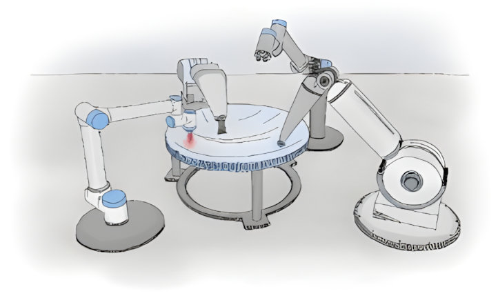
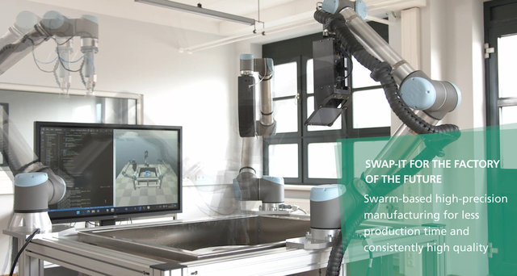
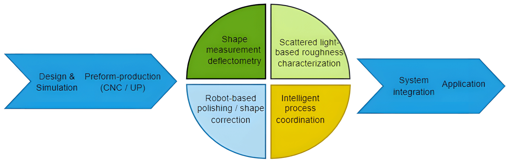
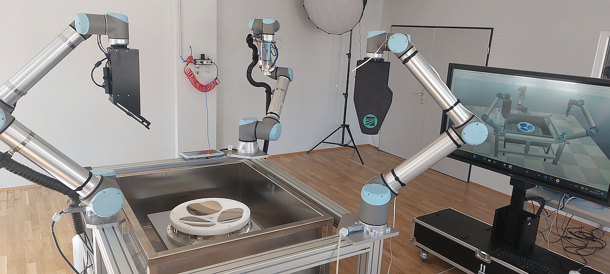
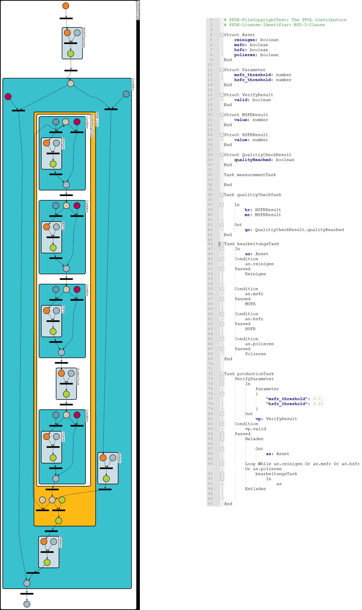
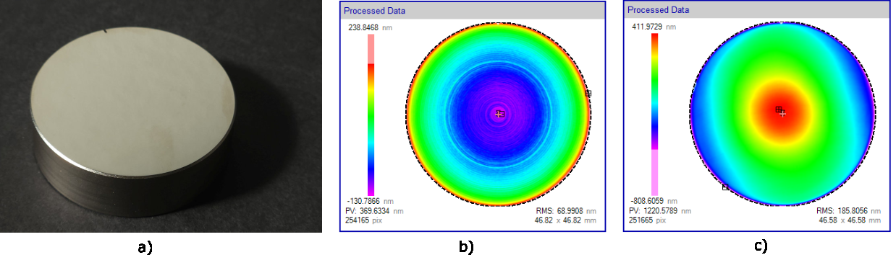
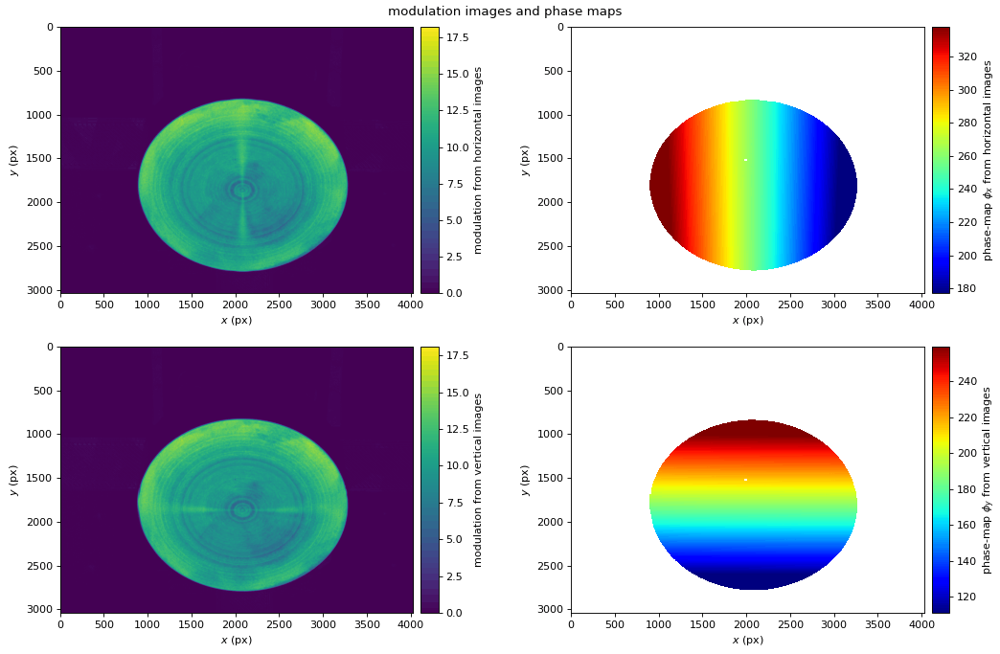
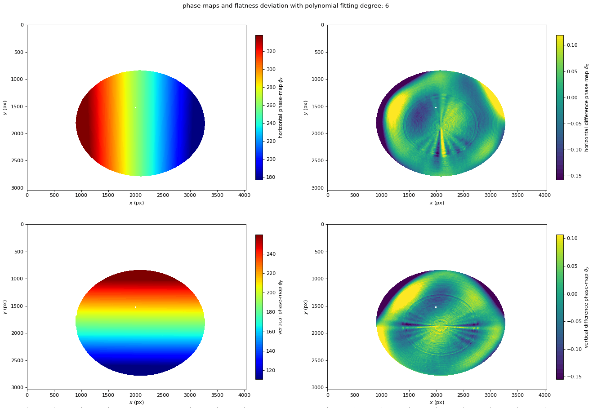
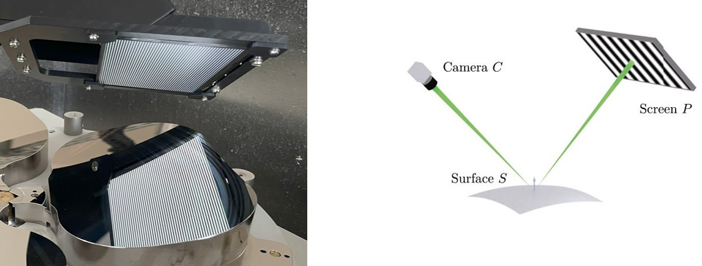

# Success Story

## SWAP-IT Use-Case "Precision Component Production"

1. [Overview](#overview)
2. [Architecture](#architecture)
3. [Getting started](#getting-started)
4. [Tutorial](#tutorial)
5. [How-To](#how-to)
6. [Contact](#contact)
7. [Related projects](#related-projects)
8. [Glossary](#glossary)
9. [Literature](#literature)

### Overview

The [SWAP-IT architecture](https://ieeexplore.ieee.org/document/9926665) was developed as part of the [Fraunhofer lighthouse project SWAP-IT](https://www.produktion.fraunhofer.de/en/research/research-cooperations/lighthouse-projects/swap.html). This new technological concept makes it possible to implement the production of tomorrow by transforming rigid production environments with individual processing stations into flexible and dynamic production environments. The core of this innovation is a modular cyber-physical production system (CPPS) that efficiently integrates centralized and decentralized elements as a network of software and mechanical components. The modules are specially designed to adapt seamlessly to different production environments and can be further developed with minimal effort. One use-case for demonstrating the benefits for this approach is for **"Precision Component Production"**.

Traditionally, high-precision components such as mirror optics are mass-produced in a time-intensive and manufactory-like process and then individually characterized using complex measurement technology. But the demand for such components is growing steadily. With conventional manufacturing processes, this leads to enormous machine costs, longer processing times, and limitations in the transition to high-quality serial components. Consequently, new manufacturing approaches are needed to meet the increased demand and at the same time enable economical as well as qualitatively excellent production with increasing requirements and high quantities.

Fraunhofer has succeeded in developing a new efficient and scalable
way while maintaining the highest quality and low costs. By means of workload-optimized manufacturing, it is possible for the first time to decouple the scaling of the number of workpieces, size and accuracy from the individual performance of the processing machines. Various operating equipment, machining, measurement and handling processes are linked to each other via in-situ process analyses and multiple cooperating robot stations. The networking and communication of the tools and measuring equipment is realized via the SWAP-IT architecture.

This involves combining various operating resources, like **additive and subtractive machining processes**, **functionalization**, and **characterization as well as measuring** and handling processes, to enable analyzing their workflow directly on site and thus, **linking of multiple cooperating robot stations** (see Fig. 1, 3 and 4). The workspace of the novel machine environment is subdivided into smaller sub-segments, which enables the use of compact, precise, and economical processing stations.

*Fig. 1: (Scene from video) With the help of the SWAP-IT architecture, industrial manufacturing processes are to become more flexible, efficient and cost-saving in the future (full video see [press release](https://www.iof.fraunhofer.de/en/pressrelease/2023/production-architecture-swap-it-for-efficient-manufacturing-proc.html)): Three robot-mounted polishing / characterization steps work together for high-precision manufacturing of mirrors*

As a result, individually adaptable components are manufactured efficiently and cost-effectively for both medium and large quantities with consistently high optical surface quality. This efficiency enables a reduction in manufacturing time of 30 percent per mirror, combined with an improvement in the quality characteristics of the mirror surface of up to a factor of two with simultaneous production of multiple mirrors and a resulting time saving by the factor "number of mirrors". The high-precision, parallelized manufacturing solution opens up individual component sizes and surface accuracies in the micrometer to nanometer range, supported by the latest AI methods. The underlying parallel and iterative batch processing, based on sensor control loops, can hereby easily implemented using the SWAP-IT architecture.

Beside the integration into the SWAP-IT architecture, a major outcome from this use case, and part of the success story of Fraunhofer IOF, was the development and presentation of the flexible optical surface sensor "goSURFmsfr" (see Fig. 2). It allows for monitoring machining marks of diamond machining, measuring mid-spatial-frequency roughness (MSFR), as well as integrated manufacturing and evaluating
of high-performance mirrors, metal optics and smartphone displays.

*Fig. 2: Flexible optical surface sensor "goSURFmsfr", developed and utilized for the "Precision Component Production" use-case, showcasing one of the highlights of this success story. For more information, see [product leaflet](https://www.iof.fraunhofer.de/content/dam/iof/en/documents/pb/goSURF-msfr-fraunhofer-iof.pdf)).*

### Architecture

The SWAP-IT architecture orchestrate multiple components and systems to work simultaneously and increase production speed and efficiency. 

This is attractive especially in dynamic and complex environments that require quick adaptability and creative problem solving.
The Load-optimized parallel processing is based on strategies and techniques like:
* Distributed systems or Assets: Networks of computers that work together to accomplish tasks.
* Load balancing: Real-time distribution of tasks based on the current utilization of resources. That ensure that workloads are distributed evenly across the available resources. 
* Synchronization and communication: Protocols and technologies that ensure that parallel processes can work together efficiently and exchange data.

The SWAP-IT architecture offers significant advantages in terms of speed and scalability. It enable companies to perform complex production steps faster and process large amounts of items more efficiently. This is achieved by a paradigm shift through parallelization of process steps and elimination spatial separation between processing and characterization steps.

* Automatic scaling: Dynamic addition or removal of resources based on current demand and utilization.
* Resource monitoring and management: Use of monitoring tools to continuously monitor the performance and utilization of resources and detect bottlenecks at an early stage.
* Efficient communication mechanisms: Use of fast and efficient network protocols and optimization of data transfer between nodes.

In Fig. 3, it is shown how our use case of manufacturing precise and high-quality optical surfaces fits into the economical and flexible production architecture.

*Fig. 3: SWAP-IT Use-Case "Precision Component Production": how manufacturing precise and high-quality optical surfaces fits within the SWAP Production Architecture.*

Use-Case Assets, according to the [SWAP-IT Demonstration Scenario](https://github.com/swap-it/demo-scenario) "either physical assets, such as production resources, or non physical assets, such as optimization approaches", define interchangeable and independent logical agents and modeled using the **Production Flow Description Language for an Order-Controlled Production** (PFDL):

* Process 1: Polishing and cleaning
* Process 2: Shape-Measurement and detection of Mid-Spacial-Frequency-Roughness (MSFR)
* Process 3: Scattered-Light-Measurement and detection High-Spacial-Frequency-Roughness (HSFR)
* Robot-Control and collision detection
* Intelligent process coordination

In Fig. 4 the realized prototype of this success story can be seen. The three processes, handled by robots interact to optimally manufacture and inspect three different work pieces.

*Fig. 4: The three interacting processes of the Use-Case "Precision Component Production": left: MSFR measurements, central: Polishing and cleaning; right: HSFR measurements.*

To model the interaction, a PFDL description of the three processes and their interactions has been created (in the repository under `/PFDL`), which is shown in Fig. 5. For any new sample, its process parameters are verified ("VerifyParameter"). Next, the sample gets loaded into the machine ("Beladen") and cleaned ("Reinigen"). After this, MSFR and HSFR measurements can be conducted, as resources allow. Now a mandatory quality check verifies, that the process parameters are reached. If not yet the case, the processing step (polishing, "Polieren") is performed. Otherwise the sample is finished and can be unloaded ("Entladen").

*Fig. 5: Workflow Modelling with PDFL: Parameter verify, sample load, Cleaning, MSFR, HSFR, Quality check, Polish, sample unload. Left) Graphical visualization of the workflow; Right) Corresponding PFDL source file.*

To summarize, these steps are performed:

* Verify sample and process parameters
  * Load sample into manufacturing
    * Clean sample
      * In parallel: HSFR measurement
      * In parallel: MSFR measurement
    * Quality check
  * Unload sample

For this use case, and this success story in particular, we furthermore focus on the **MSFR aspect** of the Precision Component Production.

### Getting started

For the context of this success story we focus on the specific aspect of the *shape measurement deflectometry* (see Fig. 3 for its position within the larger precision component production use case). See section [Related projects](#related-projects) for further information about the other important aspects of the broader SWAP-IT context.

To begin with, clone the repository [swap-success-story](https://gitlab.cc-asp.fraunhofer.de/swap/use-case-praezisionsbauteil/swap-success-story). It contains this documentation, the use cases source code, accompanying PFDL files for process orchestration and interaction with Order-Controlled Production environments, and example data for the [Tutorial](#tutorial).

Along with the source and this documentation, we also provide sample data of two cylindrical test objects (diameter 46 mm, height 16 mm, see Fig. 6) to get you started. These are ultra precision manufactured metal optics, where the "***MSFR sample***" is showing machining marks and the "***Slope sample***" is showing some slight surface bending. To access this, navigate to the "*Release*" section (or "*Deploy*" &rarr; "*Releases*") and download the sample data you are interested in.

*Fig. 6: The provided sample data: a) photo of a ultra precision manufactured metal optic; and reference interferometry surface mesurements of b) the "***MSFR sample***", showing machining marks; and b) the "***Slope sample***", showing some slight surface bending.*

Each of the sample data consists of a 8 bit grayscale image stack in TIFF format called "cam_pos00.tiff". This stack contains of 49 single images (a combination of sequential coded light and phase shift approach, see [Luhm2020]) of the same object, showing a sequence of reflected Gray code + sinusoidal patterns as following:

1. "Dark" image (no illumination at all)
2. "Bright" image (all pixels illuminated)
3. 8x "vertical" Gray code images ("xi" orientation)
4. 16x "vertical" sinusoidal images ("xi" orientation, shifted by 22.5°)
5. 7x "horizontal" Gray code images ("eta" orientation)
6. 16x "horizontal" sinusoidal images ("eta" orientation, shifted by 22.5°)

The provided images were obtained with the Flexible optical surface sensor "goSURFmsfr" (see Fig. 2). Patterns were digitally shown on a display and the reflection on the measurement object was captured.

### Tutorial

We provide a beginners tutorial, showing how to process image stacks of flat objects, in order to make mid-spatial-frequency (MSFR) defects visible. To use the provided source on your own measurements, refer to the [How-To](#how-to) section. First, clone the repository using `git`:

~~~
git clone https://gitlab.cc-asp.fraunhofer.de/swap/use-case-praezisionsbauteil/swap-success-story.git
~~~

Then open a python terminal and change into the source directory. For convinience you can create and activate a virtual environment in the source folder:

~~~
python -m venv env
env\Scripts\activate
~~~

Next, install the required packages (mainly numpy, PyQt6, matplotlib, opencv-python):

~~~
pip install -r requirements
~~~

Now the input data file (contents see section [Getting started](#getting-started)) must be provided in the same working directory, named as `cam_pos00.tiff`. Finally you can start the data processing by:

~~~
python unwrap-workflow.py
~~~

As result, two figures are calculated and shown (see Fig. 7 and 8), and three classes of result data are saved:

1. `[phi|eta]_modulation.[big|npy]` &rarr; Array containing the *modulation* of the probe.
2. `[phi|eta]_unwrapped.[big|npy]` &rarr; Array containing the *unwrapped phase* of the probe.
3. `[phi|eta]_deviation.[big|npy]` &rarr; Array containing the *deviation* of the probe from a 6th grade polynomial.

In this tutorial, *phi* refers to information gained from horizontal pattern shifts, whereas *eta* refers to information gained from vertical ones. *Big* is a short `float32` binary array format with a short header, whereas *npy* is the Python | NumPy standard data file format.

In Fig. 7 you see a plot from the provided "MSFR sample" data and its resulting modulation (left column) and unwrapped phase (right column), once for the phi (upper row), and once for the eta (lower row) patterns. In the modulation you can already see faint, circular chatter marks. However, after subtracting a 6th grade polynomial, Fig. 8 shows the overall flatness deviation and chatter marks much more pronounced.

*Fig. 7: Result of executing the tutorial for the provided "MSFR sample" data: Plots for* ***modulation** (left column) and* ***unwrapped phase** (right column), once for the phi (upper row), and once for the eta (lower row) patterns.*

*Fig. 8: Result of executing the tutorial for the provided "MSFR sample" data: Plots for* ***unwrapped phase** (left column) and* ***flatness deviation** (right column), once for the phi (upper row), and once for the eta (lower row) patterns.*

### How-To

So far we have shown how to process the provided sample image stacks. This section describes, what is required to record your own data set. The underlying basic principle of *Phase-measuring deflectometry* is shown in Fig. 9:

*Fig. 9: Left: Physical realization of the flexible optical surface scanner in the SWAP demonstrator; right: schematics of the* ***Phase-measuring deflectometry** measurement principle (from [Hern2024]).*

In short, you need to set up a display, which displays the patterns as described in section [Getting started](#getting-started). Furthermore, you need to set up your reflecting measurement object and recording camera in such a way, that the camera can monitor the display, as reflected in the object (see Fig. 9).

Now, each single pattern has to be displayed and recorded as a 8 Bit grey image. After you finished, convert the individual images into a single TIFF image stack called `cam_pos00.tiff`.

For adjustment to the unwrap parameters, e.g., differing number of sinusoidal images or different display resolution, you can change the configuration in the `unwrap-workflow.py` file, which defaults to the following:

~~~yaml
    "working_directory": working_directory,
    "projector_img_width": 1280,
    "projector_img_height": 800,
    "sine_period_length_x": 16,
    "sine_period_length_y": 16,
    "sine_patterns_x": 16,
    "sine_patterns_y": 16,
    "modulation_threshold": 4
~~~

### Contact

For project management related inquiries for the use case "Precision Component Production" at lead project SWAP, and application oriented requests, please contact **Prof. Dr. Gunther Notni**, Fraunhofer IOF, Albert-Einstein-Straße 7, 07745 Jena (phone +49 3641 807-217, email gunther.notni@iof.fraunhofer.de).

For technical questions regarding the documentation and tutorial, please feel free to contact M. Heinze (matthias.heinze@iof.fraunhofer.de) or C. Munkelt (christoph.munkelt@iof.fraunhofer.de).

### Related projects

The product leaflet for the utilized roughness sensor for the Measurement of Mid-Spatial-Frequency Roughness of High-Performance Metal Optics can be found here: .

Further information on the Fraunhofer SWAP lead project can be found on the project website of the [Fraunhofer Lead Project SWAP](https://www.fraunhofer.de/en/research/lighthouse-projects-fraunhofer-initiatives/fraunhofer-lighthouse-projects/swap.html).

[Press release](https://www.iof.fraunhofer.de/en/pressrelease/2023/production-architecture-swap-it-for-efficient-manufacturing-proc.html) (including **video** "SWAP – Hierarchical swarms as production architecture with optimized utilisation" for the SWAP use-case "Precision Component Production").

Please also note the accompanying press release of the Fraunhofer-Gesellschaft: [ SWAP-IT: Innovative production architecture for the factory of the future](https://www.fraunhofer.de/en/press/research-news/2023/april-2023/swap-it-innovative-production-architecture-for-the-factory-of-the-future.html).

The Open Source Modul [ApSi3d](https://gitlab.cc-asp.fraunhofer.de/swap/entwicklungen/swap-os-components/swap-apsi3d.git) generates high accurate surface representatios based on image stacks. 

The following projects are part of the SWAP-IT cosmos. Further information on their interplay and usage can be either found in the individual repositories or in the [SWAP-IT Demonstration Scenario](https://github.com/swap-it/demo-scenario):

* [PFDL-Scheduler](https://github.com/iml130/pfdl)
* [open62541 OPC UA SDK](https://github.com/open62541/open62541)
* [swap-it-open62541-server-template](https://github.com/FraunhoferIOSB/swap-it-open62541-server-template)
* [Common Information Model](https://github.com/FraunhoferIOSB/swap-it-common-information-model)
* [SWAP-IT Demonstration Scenario](https://github.com/swap-it/demo-scenario)

### Glossary

Assignment Agent
: Entity that interacts with an Execution Engine and a Device Registry to assign a service to one concrete resource out of a set of possible resources.

Device Registry
: Registry Module where resource OPC UA server, representing field level devices, can register themself and thus, make themself available to execute PFDL services. In addition, the Device Registry has a build-in functionality to filter suitable resources for a service execution based on a resource’s capabilities.

Execution Engine
: Interface between the PFDL scheduler and field level resources that executes the scheduled services on the field level. In addition, it handles the parameter flow between services and tasks.

HSFR
: High-Spacial-Frequency-Roughness, refers to the fine, small-scale variations in surface texture that occur at high frequencies. This type of roughness is characterized by short wavelength features, which can be significant in applications like optics, semiconductor manufacturing, and surface coatings.

Modulation
: (in the context of phase shifting measurement methods) The contrast between dark and bright fringes.

MSFR
: Mid-Spacial-Frequency-Roughness, refers to surface texture variations that occur at intermediate wavelengths.

OPC UA Information Model
: Contains all nodes and references to map a specific entity to an OPC UA server.

PFDL
: [Production Flow Description Language for an Order-Controlled Production](https://ieeexplore.ieee.org/document/10003953) is a domain specific language that describes a production order. It is parsed by the scheduler and transformed into a structure to schedule the execution.

PFDL Scheduler
: Generates a process sequence out of a PFDL description and schedules the specified services and tasks.

Phase
: (in the context of phase shifting measurement methods) The position of a point in the wave cycle of the light waves being compared. It is typically represented as an angle (in radians) and indicates the relative displacement between the reference and measurement beams.

Phase-measuring deflectometry
: An optical measurement technique used to determine the shape and surface profile of an object by analyzing the phase shifts in reflected fringe patterns. By projecting a series of fringes onto the surface and measuring the resulting deformation of these patterns, the technique allows for high-precision 3D reconstruction of the object's surface.

Process Agent
: Agent consisting of a PFDL scheduler and an Execution Engine. It drives the execution of the process specified within a PFDL.

SWAP-IT
: [A Scalable and Lightweight Industry 4.0 Architecture for Cyber-Physical Production Systems](https://ieeexplore.ieee.org/document/9926665).

### Literature

[Lüns2022]
: D. Lünsch, P. Detzner, A. Ebner and S. Kerner, "SWAP-IT: A Scalable and Lightweight Industry 4.0 Architecture for Cyber-Physical Production Systems," 2022 IEEE 18th International Conference on Automation Science and Engineering (CASE), Mexico City, Mexico, 2022, pp. 312-318, doi: 10.1109/CASE49997.2022.9926665.

[Detz2022]
: P. Detzner, A. Ebner, M. Hörstrup and S. Kerner, "PFDL: A Production Flow Description Language for an Order-Controlled Production," 2022 22nd International Conference on Control, Automation and Systems (ICCAS), Jeju, Korea, Republic of, 2022, pp. 1099-1106, doi: 10.23919/ICCAS55662.2022.10003953.

[Hern2024]
: N. Mosquera Hernandez, "Developing a Proof of Concept for a Cost-Efficient, High-Precision Deflectometry System," Faculty of Physics and Astronomy, Friedrich Schiller Universität Jena, 2024.

[Luhm2020]
: T. Luhmann, S. Robson, S. Kyle, J. Boehm, "[Close-Range Photogrammetry and 3D Imaging](https://doi.org/10.1515/9783110607253)", Berlin, Boston: De Gruyter, 2020.

## License

Distributed under the BSD-3-Clause [license](LICENSES/BSD-3-Clause.txt). See folder `LICENSES` for more information.